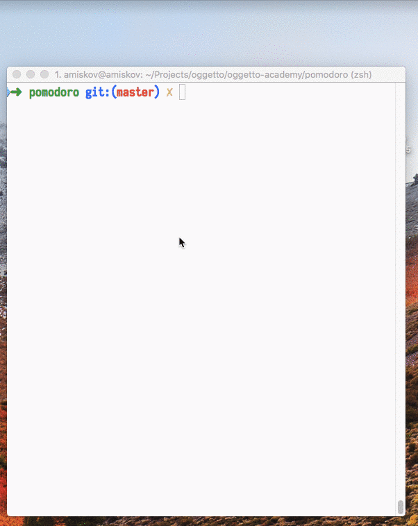

# Pomodoro Timer
Реализуйте консольный [помидорный таймер](https://ru.wikipedia.org/wiki/Метод_помидора) для личного использования.

Вам пригодится NPM-пакет [node-notifier](https://www.npmjs.com/package/node-notifier) для нотификации пользователя и функция [pluralize](pluralize.js) для формирования правильных окончаний при выводе времени: 1 минута, 3 минуты, 10 минут и т. п.

Примерная работа программы, ускоренная в 200 раз:



Чтобы можно было вызвать ваш таймер из любого места в консоли, создайте алиас в вашем `~/.bash_profile`:

```bash
alias pmdr="node ~/Projects/pomodoro/index.js"
```

Вы можете модифицировать интерфейс и какие-то детали так, как считаете нужным. Например, нарисовать свои иконки помидора в пиксель-арте или написать текст по-английски или дать возможность пользователю изменять время через параметры запуска.
